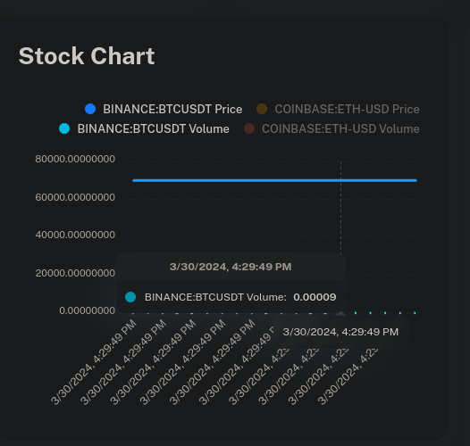
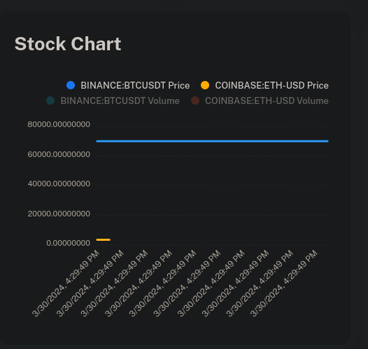
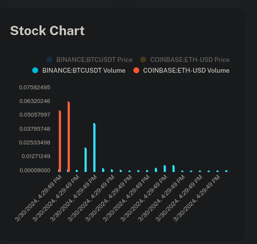

# real-time-stock-ticker

Building a real-time stock ticker using Node.js, MongoDB, Apache Kafka, and Redis. The system is scalable, reliable, and provides users with real-time and accurate stock prices.

## Steps to run the APP

1. Run command: `sudo chown -R 1001:1001 data`

2. Build Docker images: `docker compose build`

3. Run Backend Server: `docker compose up`

## Steps to start the UI server

1. Install and use the `Node.js 18.x`

2. Navigate to the `stock_ticker_ui` folder/directory.

3. Install the packages: `yarn install`

4. Start the UI server: `yarn dev`

5. [Optional] Build the UI for deployment: `yarn build`

### Snap shots of UI

- Bitcoin Price vs Volume:

> 

- Bitcoing vs Coinbase price:

> 

- Bitcoing vs Coinbase Volume:

> 
